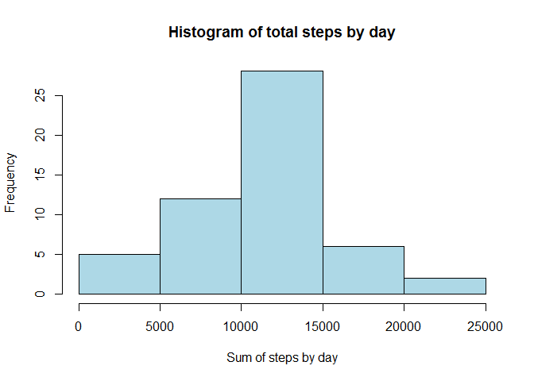
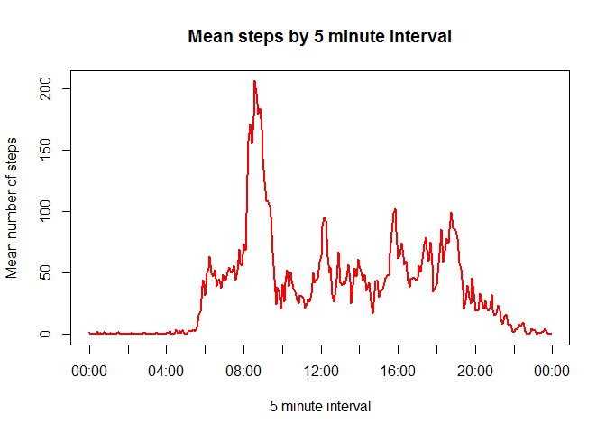
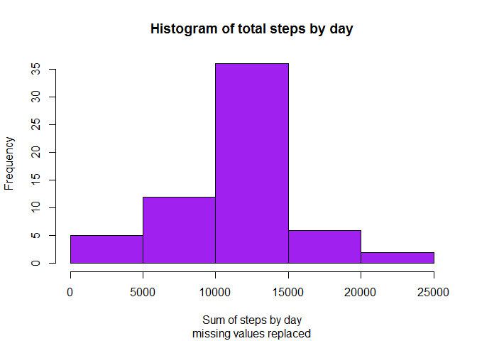
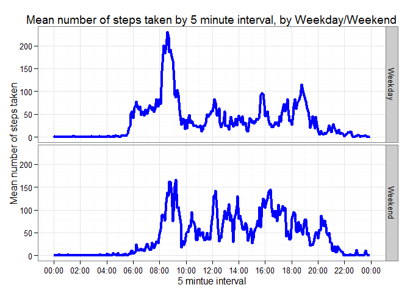

# Reproducible Research: Peer Assessment 1


## Loading and preprocessing the data
### Part 1 - loading libraries, unzipping and reading the data
The data for this assignment exists as a zip file in the working directory.  To prepare the data:  
-  Load the libraries to be used for the assignment  
-  Unzip the data to ./Data (create the directory if it does not exist)  
-  Read the data as a dataframe  


```r
library(ggplot2)

if (!file.exists("./Data")) {
    dir.create("./Data")
}

activity <- read.csv("./Data/activity.csv")
```

### Part 2 - processing date and interval
Using a basic read.csv leaves steps and interval as integers and date as character.  
This is appropriate for steps, but making interval more descriptive and date a date object will help us with processing and labeling later on  
Processing date is straightforward:

```r
activity$date <- as.Date(activity$date)
```

Processing interval takes a little more work  
-  Convert to character of format "0000" so strptime will work   
-  Convert to a time object using strptime()  
-  Convert back to a string with a time format using format()  

```r
activity$interval <- as.character(activity$interval)

activity[nchar(activity$interval)==1,"interval"] <- 
    paste("0",activity[nchar(activity$interval)==1,"interval"],sep="")

activity[nchar(activity$interval)==2,"interval"] <- 
    paste("0",activity[nchar(activity$interval)==2,"interval"],sep="")

activity[nchar(activity$interval)==3,"interval"] <- 
    paste("0",activity[nchar(activity$interval)==3,"interval"],sep="")

activity$interval <- format.POSIXlt(strptime(activity$interval, "%H%M"),"%H:%M")

str(activity)
```

```
## 'data.frame':	17568 obs. of  3 variables:
##  $ steps   : int  NA NA NA NA NA NA NA NA NA NA ...
##  $ date    : Date, format: "2012-10-01" "2012-10-01" ...
##  $ interval: chr  "00:00" "00:05" "00:10" "00:15" ...
```
Now we are ready to go forward. 

## What is mean total number of steps taken per day?
There are several different ways to sum the total steps taken by day. 
I've chosen to use the aggregate function, since it omits missing 
values by default, and that is what we are meant to do here.  
  
Step 1 is to do the aggregation and draw a histogram:

```r
sumDay <- aggregate(steps ~ date, data = activity, FUN = sum)
hist(sumDay$steps, col="light blue", main = 
         "Histogram of total steps by day", xlab = "Sum of steps by day")
```

 
  
Step 2 is to calculate the mean and median of the total steps per day

```r
stepsMean <- mean(sumDay$steps, na.rm = TRUE)
stepsMedian <- median(sumDay$steps, na.rm = TRUE)
```
  
And then print the results inside of the text!  
The **mean** number of steps taken per day is 
**10,766**  
The **median** number of steps taken per day is 
**10,765**  

## What is the average daily activity pattern?
This time, instead of aggregating the data as a sum across the days, I aggregate
the data as a mean by interval:

```r
meanIval <- aggregate(steps ~ interval, data = activity, FUN = mean)
```
  
Now take that data and plot it by time:

```r
xR <- as.POSIXct(c("00:00","24:00"),format="%H:%M")
xRseq <- seq(xR[1],xR[2],length.out=13)


plot(strptime(meanIval$interval,"%H:%M"), meanIval$steps, type = "l", lwd = 2, col = "red",xaxt="n",
     main = "", xlab = "", ylab = "")
axis.POSIXct(1,at=xRseq)
title(main = "Mean steps by 5 minute interval",xlab="5 minute interval",ylab="Mean number of steps")
```

 
  
Finally, find and report the interval with the maximum mean number of steps,
again reporting in-line with the markdown text:

```r
maxIval <- meanIval$interval[meanIval$steps==max(meanIval$steps)]
```
  
The interval with the maximum average number of steps is the 5-minute
period beginning at **08:35**

## Imputing missing values
Here are the number of missing values in the original data:  

```r
naTable <- sapply(activity,function(x) {
    sum(is.na(x))
})

print(naTable)
```

```
##    steps     date interval 
##     2304        0        0
```
  
Rather than omitting the missing values, I will replace  them with the 
mean of the interval calculated in the previous question.  I will do the following:  
-  Merge the original data and the mean by interval table, creating a new data set  
-  Find the observations with missing data from the original step count  
-  Replace the missing values in those observations with the merged-in mean  
-  Drop the column containing the interval means  
-  Rename the columns to undo the name changes introduced by the merge    

Or, in R code:

```r
actReplace <- merge(activity, meanIval, by.x = "interval",by.y="interval")
indexer <- is.na(actReplace$steps.x)
actReplace$steps.x[indexer] <- actReplace$steps.y[indexer]
actReplace <- actReplace[,1:3]
colnames(actReplace)[2] <- "steps"
```
  
How does this data compare with the original?  Here are is the histogram
to compare with above:  

```r
sumDayR <- aggregate(steps ~ date, data = actReplace, FUN = sum)
hist(sumDayR$steps, col="purple", main = "Histogram of total steps by day",
     sub = "missing values replaced", xlab = "Sum of steps by day")
```

 
  
Also the mean and median:

```r
stepsMeanR <- mean(sumDayR$steps, na.rm = TRUE)
stepsMedianR <- median(sumDayR$steps, na.rm = TRUE)
```
  
Things haven't changed that much.  The mean is now 
**10,766** as compared to
**10,766** originally.  The median is now
**10,766** as compared to 
**10,765**  originally.
We really shouldn't be surprised by this--missing values were initially omitted from
the calculation of the mean and median.  Replacing the omitted values with average values should
not change the central tendency very much.  A careful examination of the two histograms will show 
that the values are now more concetrated around the median.  

## Are there differences in activity patterns between weekdays and weekends?
The first thing to do is to use the Weekdays() function to assign the factor
"weekend" to dates that are a Saturday or Sunday, and "weekday" to everythign else, like so:  

```r
wkend <- c("Saturday","Sunday")
actReplace$daytype[weekdays(actReplace$date) %in% wkend] <- "Weekend"
actReplace$daytype[is.na(actReplace$daytype)] <- "Weekday"
actReplace$daytype <- as.factor(actReplace$daytype)
```
  
Now I can calculate the mean by interval by weekend factor, and plot them 
on top of eachother to illustrate the difference.  I've chosen to use ggplot, 
since I prefer the aesthetic.  This necessitated a little manipulation up front
to get it to play nicely with the time interval.  

```r
meanWdayInt <- aggregate(steps ~ interval + daytype, data = actReplace, FUN = mean)
meanWdayInt$numint <- as.numeric(substr(meanWdayInt$interval,1,2)) + 
                            as.numeric(substr(meanWdayInt$interval,4,5))/60
timeLabels <- c(meanWdayInt$interval[seq(1,11+(23*12),by = 24)],"00:00")
myPlot <- ggplot(meanWdayInt, aes(numint, steps))
myPlot <- myPlot + geom_line(colour = "blue", size = 1.5)
myPlot <- myPlot + facet_grid(daytype ~ .)
myPlot <- myPlot + theme_bw()
myPlot <- myPlot + scale_x_continuous(breaks = seq(0,24,by=2), labels = timeLabels)
myPlot <- myPlot + ggtitle("Mean number of steps taken by 5 minute interval, by Weekday/Weekend")
myPlot <- myPlot + xlab("5 mintue interval") + ylab("Mean number of steps taken")
print(myPlot)
```

 
  
Not surprisingly, there are some differences.  The subject tended to take more steps early in
the day during the week, and late in the day during the weekend.  Also, the peak right around 8:30
in the morning is moderated on the weekend, perhaps because the subject is regulary commuting at that 
time during the week
